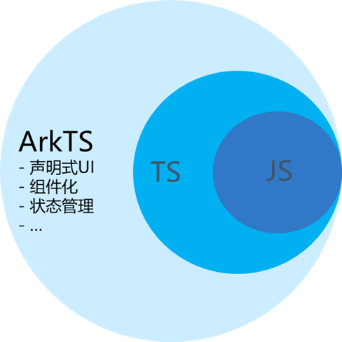

# OurEDA 实验室 2024 级 Web 方向寒假作业

*22-ly*

## 前言

感谢您选择 Web 作为您的学习方向，为确保您的阅读体验流畅，请使用 `Typora`，`Vscode`，`MarkText` 等支持 Markdown 渲染的软件阅读本文档，在您完成本次作业之前请务必仔细阅读本文档以免您提交的内容与实际要求有所出入

本次作业分为作业一和作业二，您至少需要选择一个进行完成

## Get Started

#### 进行赛博扫盲

计算机基本使用扫盲：[电子扫盲课，第一节 最基础认识电脑](https://www.bilibili.com/video/BV1Mi421v72a/?share_source=copy_web&vd_source=cd2932e811b65858899b15b70169de9e)

计算机“高级”操作扫盲：

1. [电子扫盲 - 华东师范大学 - 博远信息技术社](https://www.bilibili.com/video/BV1JkzGYuEGo/?share_source=copy_web&vd_source=cd2932e811b65858899b15b70169de9e)

2. [计算机教育中缺失的一课](https://missing-semester-cn.github.io/)

3. [Git、GitHub 和 Gitee 完整讲解：从基础到进阶功能](https://www.bilibili.com/video/BV1G8CFYvEjt/?share_source=copy_web&vd_source=cd2932e811b65858899b15b70169de9e)


下载压缩文件及解压缩：推荐您安装并使用 [7-zip](https://7-zip.org/) 这款开源软件

如何正确安装正版软件（以 Steam 为例）：[正版Steam如何下载？Steam下载｜安装｜注册｜使用全套流程](https://www.bilibili.com/video/BV15j411w7ER/?share_source=copy_web&vd_source=cd2932e811b65858899b15b70169de9e)

#### 学习代码命名规范与规范代码风格

代码命名规范是指对代码中各种元素（如变量、函数、类等）的命名方式进行统一的规定。一个好的命名应该简洁明了、见名知意，能够准确地反映出该元素的含义和作用

代码风格是指代码编写的格式和样式，包括缩进、空格、注释、代码块的组织等方面。统一的代码风格可以提高代码的可读性，减少阅读和理解代码所花费的时间

推荐您阅读代码随想录在知乎上发布的文章：[看了这么多代码，谈一谈代码风格！](https://zhuanlan.zhihu.com/p/305642194)

常用的 `JavaScript` 代码风格指南：

- **缩进**：一般使用 4 个空格进行缩进
- **引号**：单引号和双引号都可以使用，但建议在同一个项目中保持一致
- **空格**：在运算符两侧、逗号后加空格，增强可读性
- **变量命名**：采用小驼峰命名法，例如：firstName、productPrice
- **函数命名**：采用小驼峰命名法，例如：getUserName
- **类名**：采用大驼峰命名法，例如：Person
- **常量**：全部大写，单词之间用下划线分隔，例如：MAX_VALUE
- **空行**：使用空行分隔不同的代码块

在不知道如何命名的情况下，推荐使用 [CodeLf](https://github.com/unbug/codelf) 这款变量命名神器

如果您烦于控制码风，推荐使用 [Prettier](https://www.prettier.cn/) 这款代码格式化工具，可以自动格式化你的代码，使其符合指定的风格

## 作业一

### 作业需求

该方向内容为学习前端开发的基础，进行简单网页开发。本次作业要求您使用前端三件套：`HTML`，`CSS` 以及 `JavaScript` 实现一款 Wordle 游戏，如果您对 Wordle 游戏缺乏足够了解，可以通过以下链接进行体验：

[Wordle，启动！](https://www.nytimes.com/games/wordle/index.html)

在 Wordle 中，玩家需要使用最多六次机会内猜中某个有五字英文字母的词汇。每次尝试后，玩家可能得到三种反馈：绿色表示字母位置正确；黄色表示答案包含该字母但位置错误；灰色表示答案没有该字母

*注：本次作业要求使用原生 `HTML5`，`CSS3` 以及 `ES6` 及更高标准的 `JavaScript` 语言完成，诸如 `var`，`==`，`prototype` 等较为古老的语法特性 **不应当** 出现在您的代码中*

### 安装 Vscode

推荐您使用 `Vscode` 作为开发工具

[Vscode 官网](https://code.visualstudio.com/)

### 学习 HTML

超文本标记语言（HyperText Markup Language，简称：`HTML`）是一种用于创建网页的标准标记语言。`HTML` 元素是构建网站的基石。`HTML` 允许嵌入图像与对象，并且可以用于创建交互式表单，它被用来结构化信息——例如标题、段落和列表等等，也可用来在一定程度上描述文档的外观和语义

推荐您通过以下途径学习 `HTML` 的基本知识：

-   [MDN/HTML](https://developer.mozilla.org/zh-CN/docs/Web/HTML)

### 学习 CSS

层叠样式表（Cascading Style Sheets，简称：`CSS`）是一种用来为结构化文档（如 `HTML` 文档或 `XML` 应用）添加样式（字体、间距和颜色等）的计算机语言。`CSS` 不仅可以静态地修饰网页，还可以配合各种脚本语言动态地对网页各元素进行格式化

推荐您通过以下途径学习 `CSS` 的基本知识：

-   [MDN/CSS](https://developer.mozilla.org/zh-CN/docs/Web/CSS)
-   [Learn Layout](https://zh.learnlayout.com/)

### 学习 JavaScript

`JavaScript` 最初被创建的目的是“使网页更生动”

这种编程语言写出来的程序被称为脚本。它们可以被直接写在网页的 `HTML` 中，在页面加载的时候自动执行。脚本被以纯文本的形式提供和执行。它们不需要特殊的准备或编译即可运行

如今，`JavaScript` 不仅可以在浏览器中执行，也可以在服务端执行，甚至可以在任意搭载了 `JavaScript` 引擎的设备中执行

推荐您通过以下途径学习 `JavaScript` 的基本知识:

-   [MDN/JavaScript](https://developer.mozilla.org/zh-CN/docs/Web/JavaScript)
-   [现代 JavaScript 教程](https://zh.javascript.info/)
-   [JavaScript 教程 - 网道](https://wangdoc.com/javascript/)

### 具体任务

*推荐您在完成本次作业前在 vscode 中安装 `Todo Tree` 这款插件*

#### 任务一：HTML 页面设计

在本任务中您需要利用您的 `HTML` 知识搭建 Wordle 网页的基本骨架，在源文件目录的 `index.html` 中您需要编写对应的 `HTML` 代码，我们希望您的 `HTML` 页面中至少包含 [Wordle 游戏](https://www.nytimes.com/games/wordle/index.html) 中的基本组件，如棋盘，可供输入的键盘以及必要的按键

#### 任务二：CSS 设计

在本任务中您需要利用您的 `CSS` 知识对您的网页进行修饰，以保证网页与 [Wordle 游戏](https://www.nytimes.com/games/wordle/index.html) 在色彩，布局与基本的交互性上基本保持一致，您需要编写的 `CSS` 代码位于 `style` 文件夹的 `wordle.css` 中

#### 任务三：JavaScript 代码补全

在本任务中您需要利用您的 `JavaScript` 知识对 `script` 文件夹中的 `wordle.js` 中的多个关键函数进行补全，以保证您的 Wordle 程序能够按正确的交互逻辑正常运行

在进行这部分工作之前请您务必仔细阅读文件中的相关注释以理解不同函数的作用，例如对于 `wordle.js` 中的 `calculateColorSequence` 函数：

```js
/**
 * calculateColorSequence()
 *
 * 计算两个单词的颜色匹配序列
 *
 * 例如：
 * 给定 answer = "apple", guess = "angel"
 *
 * 那么返回结果为："gbbyy"
 *
 * 请思考：
 * 1. Wordle 的颜色匹配算法是如何实现的
 * 2. 有哪些特殊的匹配情况
 *
 * @param {string} guess
 * @param {string} answer
 * @return {string} colorSequence
 */
function calculateColorSequence(guess, answer) {
    // TODO: 在此处补全您的函数
}
```

您需要在阅读其注释过后补全对应代码以使得该函数的运行结果符合预期，如果您有在 `LeetCode` 等网站练习编程的经历，您应当对这种模式十分熟悉

#### 任务四：CodeWars 代码测试

在本任务中您需要验证您在任务三中设计的 Wordle 核心函数 `calculateColorSequence` 的正确性

首先您需要注册 `CodeWars` 网站：
[CodeWars](https://www.codewars.com/)

其次您需要完成 `A Brave New Wordle` 这道题目：[A Brave New Wordle](https://www.codewars.com/kata/62013b174c72240016600e60/train/javascript)

您需要将补全函数复制到题目中并进行提交，我们希望您的函数能够完美地通过这道题目

在答辩当日您需要当堂展示提交这道题目的过程以验证您的代码的正确性

##### 题目描述

Wordle is a game where users try to guess a hidden 5 letter word. Feedback is given for each guess, in the form of colored tiles, indicating when letters match or occupy the correct position.

###### The Brief

Make a function that takes in a 5 letter guess and, comparing to a known solution, returns clues for the user to solve the wordle puzzle.

###### Requirements

The function takes in two strings of 5 letters each, a guess and a solution.
The function returns a string of 5 letters.
The returned string is composed of letters each corresponding to a letter of the guess: 'b' (black) when the letter is not present in the answer; 'y' (yellow) when the letter is present but in a different location; and 'g' (green) when the letter is present and in the right location.
Duplicates
A letter appearing in the correct place is always green, including if it appears elsewhere in the word.
A letter can only be green or yellow as many times as it appears in the correct answer. Extra occurences of that letter are marked as 'b'. Below are some examples, see example tests for more:
letters are evaluated left to right.

###### 示例

```
Guess: xxxxx
Answer: yxxxx
Expected Output: bgggg
Explanation: extra letters marked as 'b'

guess: xxxxz
answer:aaaax
expected output: ybbbb
first x marked as 'y',  and each one as 'b' after
```

#### 任务五：项目部署（可选）

在您的服务器上部署本项目（提示：[阿里云](https://university.aliyun.com/) 和 [华为云](https://activity.huaweicloud.com/free_test/index.html) 均可以使用学生认证白嫖）

也可以使用 Netlify 或 Cloudflare Pages 等服务进行部署

## 作业二

### 作业需求

该方向内容为学习 HarmonyOS NEXT 移动端 APP 开发。本次作业要求您使用 `ArkTS`，`ArkUI` 以及华为基于 IntelliJ IDEA Community 开源版本开发的一站式开发平台 `HUAWEI DevEco Studio` 实现一款 2048 小游戏，如果您对 2048 缺乏足够了解，可以通过以下链接进行体验：

[2048，启动！](https://www.2048.org/)

### 注册成为 HarmonyOS NEXT 开发者

在华为开发者联盟网站上，[注册成为开发者](https://developer.huawei.com/consumer/cn/doc/start/registration-and-verification-0000001053628148)，并完成[实名](https://developer.huawei.com/consumer/cn/doc/start/rna-0000001062530373)认证

### 了解 HarmonyOS

您可以通过阅读 HarmonyOS 官方文档了解什么是 HarmonyOS

[HarmonyOS 概述](https://developer.huawei.com/consumer/cn/doc/harmonyos-guides-V3/harmonyos-overview-0000000000011903-V3)

### 学习 ArkTS

ArkTS 为 HarmonyOS NEXT 项目的主要编程语言，它基于 TypeScript，通过与 ArkUI 的匹配，扩展了声明式 UI、状态管理等相应的能力

- JavaScript 是一种属于网络的高级脚本语言，已经被广泛用于 Web 应用开发，常用来为网页添加各式各样的动态功能，为用户提供更流畅美观的浏览效果
- TypeScript 是 JavaScript 的超集，它扩展了 JavaScript 的语法，通过在 JavaScript 的基础上添加静态类型定义构建而成，是一个开源的编程语言
- ArkTS 是 TypeScript 的超集，拓展了声明式 UI、状态管理、并发任务等能力



推荐您通过华为官方文档学习 ArkTS

[初识ArkTS语言-学习ArkTS语言-基础入门 - 华为HarmonyOS开发者](https://developer.huawei.com/consumer/cn/doc/harmonyos-guides-V5/arkts-get-started-V5)

### 学习 ArkUI

开发者可以使用 [ArkUI](https://developer.huawei.com/consumer/cn/doc/harmonyos-guides-V5/arkui-overview-V5) 的 UI 组件绘制应用界面。ArkUI 是一套构建分布式应用界面的声明式 UI 开发框架，它提供了丰富的 UI 组件、动画、交互事件、实时界面预览工具等，可以帮助我们快速入门 HarmonyOS 应用开发。ArkUI 提供了规则图形绘制和用户自定义绘制，通过调用 ArkUI 规则图形组件、事件，可以快速实现应用界面，提升 HarmonyOS 应用界面开发效率

推荐您通过华为官方文档学习 ArkUI

[ArkUI简介-ArkUI（方舟UI框架）-应用框架 - 华为HarmonyOS开发者](https://developer.huawei.com/consumer/cn/doc/harmonyos-guides-V5/arkui-overview-V5)

### 安装并配置 DevEco Studio

HUAWEI DevEco Studio 是华为基于 IntelliJ IDEA Community 开源版本开发的一站式开发平台，专为 HarmonyOS 系统上的应用和服务设计，请根据 [华为开发者联盟文档](https://developer.huawei.com/consumer/cn/doc/harmonyos-guides-V5/ide-quick-start-V5) 进行下载安装和配置

### 具体任务

#### 任务一：App 页面设计

在本任务中您需要利用您的 `ArkTS` 知识搭建 2048 游戏的基本骨架，在源文件目录的 `entry/src/main/ets/pages/Index.ets` 中您需要编写对应的 `ArkTs` 代码，我们希望您的 App 中至少包含 [2048 游戏](https://www.2048.org/) 中的基本组件，如 4 × 4 格子，标题，分数以及最高分数，开启新游戏的 `Button`

#### 任务二：逻辑代码编写

在本任务中您需要编写业务代码，如响应滑动手势、数据更新、游戏结束判断等逻辑功能

#### 任务三：进行模拟器/真机调试

DevEco Studio 提供了本地模拟器供开发者使用，可以根据官方教程进行安装

[创建模拟器-管理模拟器-使用模拟器运行应用/元服务-应用/元服务运行-DevEco Studio - 华为HarmonyOS开发者](https://developer.huawei.com/consumer/cn/doc/harmonyos-guides-V5/ide-emulator-create-V5)

使用真机调试的官方教程

[使用本地真机运行应用/元服务-应用/元服务运行-DevEco Studio - 华为HarmonyOS开发者](https://developer.huawei.com/consumer/cn/doc/harmonyos-guides-V5/ide-run-device-V5)

> [!NOTE]
>
> 能且仅能使用运行有 HarmonyOS NEXT 的设备进行真机运行与调试，其他安卓苹果设备（包括运行有安卓套壳的 HarmonyOS 的华为及荣耀设备）是无法进行真机运行与调试的

## 答辩 PPT 制作

您需要将您的开发过程整合到 `doc` 文件夹中的 `presentation.pptx` 中，请 **务必** 使用该模版制作您的 PPT

我们希望您的 PPT 中至少包含以下内容：

1. 每个任务的设计思路（不必包含本任务）
2. 项目总结
3. 新学期的个人规划与展望

我们不希望您的 PPT 中包含以下内容：

1. 对源代码的大段复制粘贴或截图
2. 与项目无关的其他内容

具体的作业答辩将包含以下三部分内容：

1. CodeWars 运行展示（如您选择作业一）
2. PPT 汇报答辩
3. 项目运行与源代码展示

## 注意事项

1. 请按照本文档以及注释的具体要求进行项目的设计与实现
2. 允许在大模型的帮助下完成本次作业，但 AI 也可能会犯错，请不要盲目相信 AI
3. 严禁抄袭其他人的成段代码，一旦发现 **取消** 答辩资格
4. 要对自己有信心
